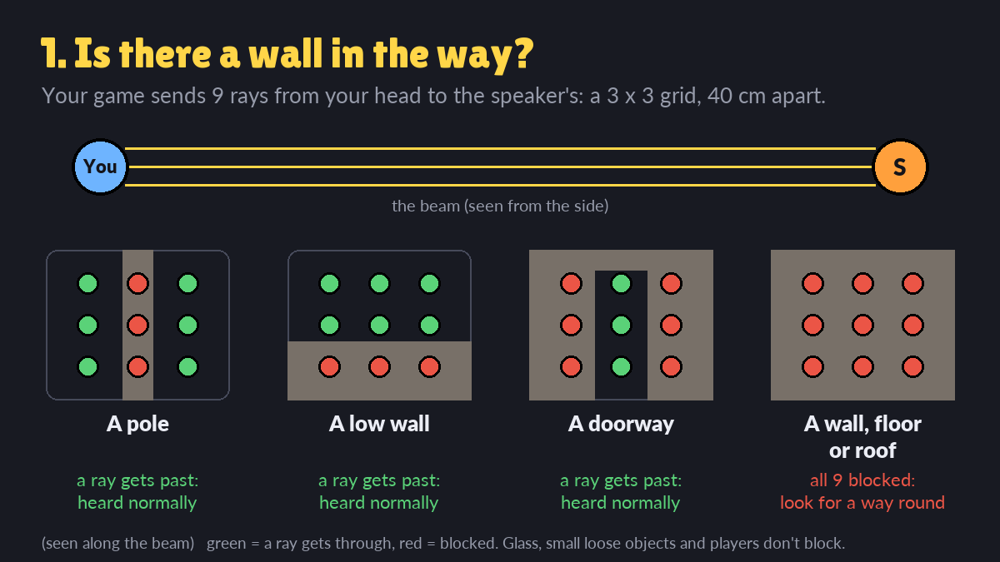
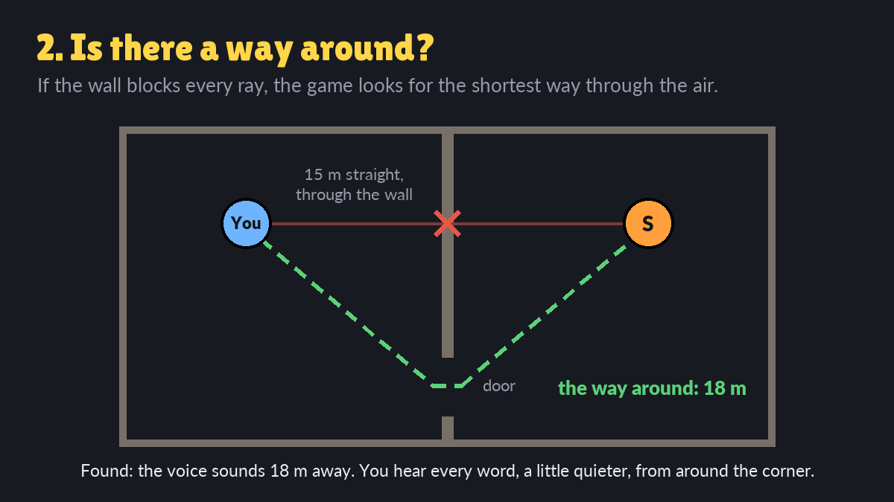
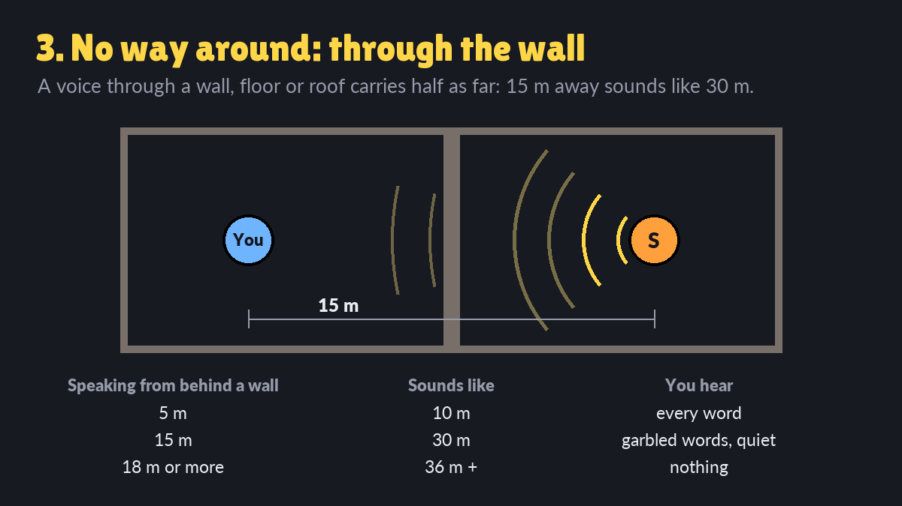

# Proximity Babble Chat: API for mod makers

Proximity Babble Chat is a global mod. A host turns it on for a session, and it then runs alongside
any map or game mode. Your mod can work with it through the **registry**, which every script on a
machine shares. Teardown mods can't call each other's functions, so these registry keys are the
whole interface:

| key | type | who writes it | where | what it does |
|---|---|---|---|---|
| [`proxchat.version`, `proxchat.alive`](#proxchatversion-proxchatalive) | int, float | the chat | each machine | the chat is running here (and which API version) |
| [`proxchat.lobby`](#proxchatlobby) | bool | your **server** script | host | while true, everything said goes to everyone |
| [`proxchat.block`](#proxchatblock) | bool | your **client** script | each machine | while true, Enter does not open the chat |
| [`proxchat.typing.<player>`](#proxchattypingplayer) | bool | the chat | host: every player; each machine: its own player | true while that player is typing |
| [`proxchat.ranges`](#proxchatranges) | string | your **server** script | host | sets the Whisper / Speak / Yell distances |
| [`proxchat.channel.<player>`](#proxchatchannelplayer) | string | your **server** script | host | `"dead"` (or `"dead red"`...): that player talks only to the same channel, and hears everyone |
| [`proxchat.walls`](#proxchatwalls) | bool | your **server** script | host | walls, floors and roofs muffle voices, or not, on your map |
| [`proxchat.said.*`](#proxchatsaid-chat-events) | several | the chat | host | an event for every message said |

Everything here is optional. If the chat isn't enabled, nothing reads the keys you set and every key
you read stays `false` / `0` / `""`, so your mod works the same without it.

## Before you start

- **Server or client.** In Teardown v2 multiplayer the host runs every `server.*` function, and every
  player (the host too) runs the `client.*` functions. The registry is per machine: a value set on
  the host is not visible on a guest's machine. The table above says where each key lives.
- **Set your keys every tick.** When the chat starts on the host, it clears every `proxchat.*` key.
  Scripts start in no fixed order, so a key you set once in `init` may be wiped. Setting it in
  `tick` is cheap and always right.
- **Player ids** are the engine's: `GetAllPlayers()` on the server, `GetLocalPlayer()` on a client.
  (`Players()` is a helper from `script/include/player.lua`; it only exists if you include that
  file.)

---

## `proxchat.version`, `proxchat.alive`

**Read only, every machine.** The chat sets both every tick on every machine where it runs:
`proxchat.version` is the API version (2 = this document), `proxchat.alive` the `GetTime()` of its last
tick. The chat draws its own "Enter: chat" hint; use these for YOUR game's hints and rules that only
make sense with a chat, so players without it never see them. A key can outlive a mod, so check that
`alive` is recent:

```lua
local function chatRuns()
	return GetInt("proxchat.version") >= 2 and math.abs(GetTime() - GetFloat("proxchat.alive")) < 1
end

-- client: a game rule worth telling, only when players can actually talk
function client.draw()
	if chatRuns() and showRules then
		UiPush(); UiTranslate(UiCenter(), 120); UiAlign("center middle"); UiFont("bold.ttf", 26)
		UiText("Monsters hear voices. Whisper near them.")
		UiPop()
	end
end
```

```lua
-- client: no chat? offer your own fallback (a "ping" on G) instead
function client.tick(dt)
	if not chatRuns() and InputPressed("g") then ServerCall("server.ping", GetLocalPlayer()) end
end
```

## `proxchat.lobby`

**Server, bool.** While it is true, the chat is in lobby mode: every message goes to every player
(Global), wherever they stand, and players can't switch to Whisper, Speak or Yell. Use it while your
game shows a lobby or menu and players are spread out or waiting.

```lua
-- your game mode's server script
function server.tick(dt)
	SetBool("proxchat.lobby", gamePhase == "lobby")   -- every tick: back to proximity chat when the round starts
end
```

Every chat event says whether it was said in your lobby (`lobby` field, below).

## `proxchat.block`

**Client, bool.** While it is true on a player's machine, Enter does not open the chat there. Set it
while your own UI needs the keyboard (a text field, a shop with typing, a name entry), so pressing
Enter for your UI doesn't also open the chat line. It doesn't close a chat line that is already open.

```lua
-- your client script
function client.tick(dt)
	SetBool("proxchat.block", nameEntryOpen)   -- every tick, true only while your text field is up
end
```

## `proxchat.typing.<player>`

**Bool, read only.** True while that player has the chat line open. While they type, the keys they
press are meant for the chat, so your mod should ignore them. Otherwise typing "q" in a message would
also fire whatever event Q is mapped to in your game.

- **On the host** (server or client script): every player's state.
- **On any machine** (client script): that machine's own player, `GetLocalPlayer()`. It is set the same
  frame the line opens and cleared the frame it closes, so no letter of a message reaches your keys.

The chat line takes the mouse and the engine stops walking and tools while it is open, but whether
your script's `InputPressed` still fires is not guaranteed: check this flag.

```lua
-- server: a per-player ability on Q that ignores players who are typing
function server.tick(dt)
	for _, p in ipairs(GetAllPlayers()) do
		if InputPressed("q", p) and not GetBool("proxchat.typing." .. p) then
			useAbility(p)
		end
	end
end
```

```lua
-- client: a local toggle on M that ignores your own typing
function client.tick(dt)
	if InputPressed("m") and not GetBool("proxchat.typing." .. GetLocalPlayer()) then
		musicOn = not musicOn
	end
end
```

```lua
-- server: freeze a player's movement while they type (an AFK-safe chat in a hectic mode)
function server.tick(dt)
	for _, p in ipairs(GetAllPlayers()) do
		if GetBool("proxchat.typing." .. p) then
			SetPlayerParam("walkingSpeed", 0, p)       -- an immediate param: set it every tick
		end
	end
end
```

## `proxchat.ranges`

**Server, string `"whisper,speak,yell"` in metres.** Sets how far each mode's words carry, for
example for a small map or a huge open one. Defaults: `"8,25,40"`.

- The garbled zone past each range follows at the same share: Whisper +50 %, Speak +40 %, Yell
  +37.5 % (so `8,25,40` garbles out to 12, 35 and 55 m).
- Values are rounded to whole metres and kept between 2 and 80 m, with whisper < speak < yell.
- It is applied when the string **changes**. The host can still move the distance bar in the chat's
  Settings afterwards; that wins until your string changes again.

```lua
-- a cramped indoor map: everything carries less
function server.tick(dt)
	SetString("proxchat.ranges", "5,15,30")
end
```

```lua
-- a storm: voices carry less while it lasts, back to normal after
function server.tick(dt)
	SetString("proxchat.ranges", stormActive and "4,12,20" or "8,25,40")
end
```

## `proxchat.channel.<player>`

**Server, string.** A channel name for a player who is out of the game (dead, spectating), as in
Lethal Company. Use `"dead"`, or one name per team (`"dead red"`, `"dead blue"`) so that the dead of
different teams can't talk to each other. Players with the **same** name form one channel:

- What they say reaches **only their own channel**, from anywhere, whatever mode they pick. The host
  sends it to those players alone, so nobody else's game has the text. Nobody sees a bubble or a "..."
  of theirs, nor hears their babble.
- They **hear everyone**: every Speak, Yell and Whisper of the living, in full, wherever they are.
- Their input line shows the channel ("Dead:", "Dead red:"), and their lines are tagged with it
  (`[dead]`, `[dead red]`).
- Your lobby (`proxchat.lobby`) comes first: in the lobby everyone hears everyone, the dead too.

Names are tidied to lower case and at most 24 characters. Set it every tick; `""` (or nothing) is the
normal channel.

```lua
-- server: dead players talk among themselves
function server.tick(dt)
	for _, p in ipairs(GetAllPlayers()) do
		SetString("proxchat.channel." .. p, GetPlayerHealth(p) <= 0 and "dead" or "")
	end
end
```

```lua
-- server: teams - each team's dead talk only to their own team's dead
function server.tick(dt)
	for _, p in ipairs(GetAllPlayers()) do
		local dead = GetPlayerHealth(p) <= 0
		SetString("proxchat.channel." .. p, dead and ("dead " .. teamOf(p)) or "")   -- "dead red", "dead blue"
	end
end
```

Their messages are still chat events, with `channel` set to the name, so your monsters can ignore them:

```lua
function onChat(e)
	if e.channel ~= "" then return end           -- the dead make no noise
	-- ... monsters hear the living
end
```

## `proxchat.walls`





Walls, floors and roofs muffle voices. This is **on by default**; the host can turn it off in the chat's
Settings ("Walls muffle voices", for everyone).

**Server, bool.** Your map or game mode can decide instead: set `proxchat.walls` to `true` (on, even if
the host turned it off) or `false` (off) every tick. While you set it, the host's row says "by the
game". Stop setting it and the host's choice applies again.

Each player's game works out how far a speaker **sounds**, and that decides both the words they make
out and the babble's volume:

1. **Is there a wall?** A beam of 9 parallel rays (3 x 3, 0.4 m apart) from the listener's head to the
   speaker's, against the static world above the debris size. Glass doesn't count. If any ray gets
   through, there is no wall: a pole, a railing, a low wall or a doorway on the line doesn't muffle.
2. **Is there a way round?** If all 9 are blocked, the engine's path planner looks for the shortest
   way through the air: a door to the side, a window, over the wall, down a corridor. Found: the voice
   sounds as far away as that way is long, so it comes round the corner, a little quieter.
3. **Otherwise, through the wall:** the voice carries half as far (a wall at 15 m sounds like 30 m).

The way round never counts as nearer than the speaker really is, and never as farther than through the
wall. It costs nothing while nobody talks: the beam runs 4 times a second per speaker with a message up,
and the way round at most once a second per speaker, 2 at a time, never longer than that voice carries
(Whisper 12 m, Speak 35 m, Yell 55 m at the defaults). A speaker too far away to hear is not checked.

```lua
-- server: a horror castle - walls always muffle, whatever the host chose
function server.tick(dt)
	SetBool("proxchat.walls", true)
end
```

```lua
-- server: a radio game mode where everyone carries a walkie-talkie - walls never muffle
function server.tick(dt)
	SetBool("proxchat.walls", false)
end
```

## `proxchat.said.*`: chat events

**Host only, read only.** Every message is also written to the host's registry as an event, so your
game can react to what players say and where they say it: monsters that hear yelling, guards that
notice whispers, a typed answer to a riddle, a vote. The last 16 events are kept in a ring:

| key | type | value |
|---|---|---|
| `proxchat.said.last` | int | the newest event number (counts up) |
| `proxchat.said.<n % 16>.player` | int | who said it |
| `... .mode` | string | `"whisper"`, `"speak"`, `"yell"` or `"global"` |
| `... .yell` | bool | `mode == "yell"` |
| `... .text` | string | the message (cleaned: no invisible or direction-changing characters) |
| `... .x`, `.y`, `.z` | float | where the speaker stood (feet) |
| `... .radius` | float | m: how far anyone hears anything, the babble included (defaults: whisper 12, speak 35, yell 55; global 0) |
| `... .wordsRadius` | float | m: how far the words are heard clearly (defaults: whisper 8, speak 25, yell 40; global 0) |
| `... .lobby` | bool | said while `proxchat.lobby` was true |
| `... .time` | float | the host's `GetTime()` when it was said |
| `... .channel` | string | the speaker's channel (`"dead"`, `"dead red"`...: only that channel heard it), else `""` |

The radii are the distances in use when the message was said, so they follow the host's settings
and `proxchat.ranges`. Whispers are events too: the chat only sends a whisper's text to the players
near enough, but the host's scripts see every event.

### Reading events

Keep the last number you handled, and each tick handle every newer one. The ring holds 16: if more
than 16 messages arrive between two reads, the oldest are lost. Each player can send about two
messages a second, so a read every tick never misses one.

The chat clears its events when a level starts. A line said just before the level loaded can still be
there for your script's first moment; its `time` is from the previous level's clock (larger than
`GetTime()` or far older). To react only to fresh lines, check `time`:

```lua
local fresh = math.abs(GetTime() - GetFloat(k .. "time")) < 1      -- said in the last second
```

The reader:

```lua
local saidSeen = nil

function server.tick(dt)
	local last = GetInt("proxchat.said.last")
	if saidSeen == nil or last < saidSeen then saidSeen = last end   -- (first tick, or the chat restarted)
	for n = math.max(saidSeen + 1, last - 15), last do
		local k = "proxchat.said." .. (n % 16) .. "."
		onChat({
			player = GetInt(k .. "player"),
			mode = GetString(k .. "mode"),
			text = GetString(k .. "text"),
			pos = Vec(GetFloat(k .. "x"), GetFloat(k .. "y"), GetFloat(k .. "z")),
			radius = GetFloat(k .. "radius"),
			wordsRadius = GetFloat(k .. "wordsRadius"),
			lobby = GetBool(k .. "lobby"),
			channel = GetString(k .. "channel"),
			time = GetFloat(k .. "time"),
		})
	end
	saidSeen = last
end
```

The examples below are `onChat` functions for that reader.

### Monsters that hear players

```lua
-- every monster within earshot turns toward the speaker; a yell enrages them
function onChat(e)
	if e.mode == "global" or e.lobby or e.channel ~= "" then return end
	for _, m in ipairs(monsters) do
		local d = VecLength(VecSub(GetBodyTransform(m.body).pos, e.pos))
		if d <= e.radius then
			m.target = e.pos                  -- go and look
			if e.mode == "yell" then m.angry = true end
		end
	end
end
```

### Guards that notice whispers (stealth)

```lua
-- whispering is quiet, not silent: a guard right next to you still hears it
function onChat(e)
	if e.mode ~= "whisper" then return end
	for _, g in ipairs(guards) do
		local d = VecLength(VecSub(GetBodyTransform(g.body).pos, e.pos))
		if d <= e.wordsRadius * 0.5 then
			raiseAlarm(g, e.player)
		end
	end
end
```

### Answers and commands typed in chat

```lua
-- a riddle: the first player to say the answer (any mode, any case) wins the round
function onChat(e)
	if roundOver then return end
	if e.text:lower():find("echo", 1, true) then
		roundOver = true
		awardPoint(e.player)
	end
end
```

```lua
-- "!ready" in chat marks a player ready while the lobby is up
function onChat(e)
	if e.lobby and e.text:lower() == "!ready" then
		ready[e.player] = true
	end
end
```

---

## Advanced: building the chat into your own mod

`chat_core.lua` can also be included in your own script, if your mod should ship with a chat
instead of relying on the host enabling Proximity Babble Chat. Don't do both: with the global mod
also enabled, players get two chats. For most mods the registry keys above are the better choice.

Copy `chat_core.lua`, `snd/` and `fonts/` into your mod, then:

```lua
#version 2
PC = {cfg = {chatR = 20, maxLen = 120}}   -- optional: overrides, before the include
#include "chat_core.lua"

PC.hooks.inLobby = function() return gamePhase == "lobby" end   -- server
PC.hooks.blockKeys = function() return nameEntryOpen end        -- client

function server.init() PC.serverInit() end
function server.tick(dt) PC.serverTick(dt) end
function client.init() PC.clientInit() end
function client.tick(dt) PC.clientTick(dt) end
function client.draw() PC.draw() end
```

Mode ids in this API are single letters, as in the chat commands (`/w`, `/s`, `/y`, `/g`): `"w"` Whisper,
`"s"` Speak, `"y"` Yell, `"g"` Global. (`"p"`, the old id for Speak, still works.)

| function | side | what |
|---|---|---|
| `PC.say(text, mode)` | client | say something as the local player; `mode` defaults to the line's current mode |
| `PC.mode()` / `PC.setMode(m)` | client | the input line's mode (`setMode` saves it as the player's default) |
| `PC.isTyping(p)` | both | server: any player; client: the local player |
| `PC.system(text)` | client | add a line only the local player sees |
| `PC.history([mode])` | client | the local history, oldest first (entries: `name`, `text`, `p`, `ch`, `far`, `sys`, `t`); with a mode, a filtered copy |
| `PC.setVoice(i)` | client | pick voice `i` (1 Squeaky, 2 Chirpy, 3 Plain, 4 Low, 5 Deep, 6 Robot) |
| `PC.page()` / `PC.setPage(pg)` | client | the chat window's page, `"chat"` or `"settings"` |

| hook (`PC.hooks.*`) | side | what |
|---|---|---|
| `inLobby()` | server | true: everything said goes to everyone (like `proxchat.lobby`) |
| `blockKeys()` | client | true: Enter does not open the chat (like `proxchat.block`) |
| `everyoneHears(speaker)` | client | true: the local player hears this speaker's Speak / Yell in full from anywhere (spectators, radios); whispers still need the whisper range |
| `onMessage(msg, heard)` | client | a message arrived: `msg = {id, p, name, ch, text}` (`ch`: the mode id, `"d"` from a channel), `heard` = the words this player made out (garbled in the buffer zone), or nil |
| `log(line)` | server | diagnostics |

```lua
-- client: a radio item - while you hold it, you hear your squad from anywhere
PC.hooks.everyoneHears = function(speaker)
	return holdingRadio and sameSquad(GetLocalPlayer(), speaker)
end

-- client: a subtitle log of what you heard, for your own HUD
PC.hooks.onMessage = function(msg, heard)
	if heard then addSubtitle(msg.name .. ": " .. heard) end
end
```

The full option list (`PC.cfg`) and more notes are at the top of `chat_core.lua`.
